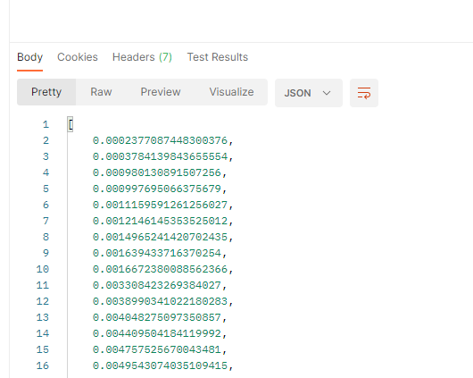

# Desafio técnico CrossCommerceStore

Esse projeto foi desenvolvido para um desafio técnico da empresa: Cross Commerce Store e se trata de uma API responsável por extrair um conjunto de número da basse de dados do link: [http://challenge.dienekes.com.br/api/numbers](http://challenge.dienekes.com.br/api/numbers).

O principal objetivo da aplicação é unir os dados extraídos e apresentá-los de forma ordenada.

## 🛠️ Bibliotecas/Linguagens
* [Node.js](https://nodejs.org/en/) 
* [Express.js](https://expressjs.com/pt-br/) 
* [Jest](https://jestjs.io/pt-BR/)
* [Axios](https://axios-http.com/docs/intro)

## ⚙️ Como utilizar?

Clone o repositório abaixo 👇 

```
git clone https://github.com/luclous/DesafioDev.git
```

Depois de feito o clone, abra o diretório onde foi clonado em seu terminal e digite o seguinte código:

```
npm install
```

Após completado as instalação das dependências, inicie o servidor com o seguinte comando em seu terminal:

```
npm run start
```

Abra o seu navegador e/ou POSTMAN ou qualquer ferramenta de requisições HTTP de preferência

Coloque como endereço, fazendo uma requisição GET a seguinte URL:

```
http://locahost:3000/
```

Ao clicar na opção SEND da sua ferramenta de quesições HTTP, haverá uma espera para o retorno e assim você obterá um retorno parecido com isso:
<p align="center">
    
  </p>
  
## :pencil2: Teste
  
Para teste unitário da função de ordenar números, use o comando:

```
npm test
```